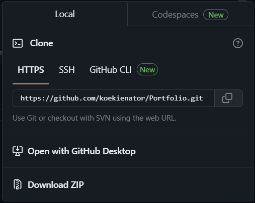

Opdracht 1:
GIT-01: Git en GitHub:

Algemene beschrijving van de opdracht:

Het leren van wat Git en GitHub zijn, en hoe deze werken.

<h2>Key-terms: </h2>

Github 
GitHub desktop app 
Repositories 
Main / master 
Branch 
Merge  
Fork 
Push/pull/clone 

<h2>**Gebruikte bronnen:**</h2>
GitHub Tutorials 
Stack Overflow website 
Mijn mede studenten 
 
 

<h2>**Ervaren problemen:**</h2>

Redelijk veel, maar niets wat niet duidelijk werd na wat gezoek binnen GitHub en/of de destop app. Ook met de hulp van mijn teamgenoten het 1 en ander kunnen oplossen.

<h1>**Uitwerking van de Opdracht:**</h1>

<h2>**Aanmaken Repository:**</h2>

Om te werken binnen Git is het nodig om een repository aan te maken.

Een repository bevat alle files van een project. 
Dit gaat binnen de desktop app via ctrl + N of via File -> New Repository.

Bij het aanmaken van een repository moet je een naam opgeven, een omschrijving van de inhoud en de lokale opslaglocatie onder “local path”. Eventueel kan je een README-file, Git-ignore file en een license toevoegen. 

Voor de opleiding heb ik een repository met de naam “Techgrounds-Cloud-11” aangemaakt met als description “Voor de Cloud opleiding”. Daarbij heb ik ook een README file aangemaakt waarbinnen ik heb vermeld dat deze repository bedoeld is voor de Cloud opleiding.

 

<h2>**Het pushen van een repository:**</h2>
Het is mogelijk om een repository (al dan niet aangepast) te pushen naar Git via de shortcut ctrl-p of via repository -> push. Dit zorgt ervoor dat een repository of de aanpassingen binnen een repository worden opgeslagen in Git.

<h2>**Main / Master en Branches:**</h2>
Bij het werken binnen een repository  heb je een Master repository welke alle goedgekeurde files bevat en kan je branches aanmaken. 
Het onderverdelen van een repository in een Master en branches wordt gedaan om zo de master versie van het project en de versie waaraan je werkt niet door elkaar te halen en daarmee aanpassingen te maken aan de inhoud zonder problemen te veroorzaken in de master code/files.
Een branch aanmaken kan binnen de app via Current Branch -> New Branch waarbij je bij het benamen van de nieuwe branch een waarschuwing krijgt mocht je een al gebruikte branch naam willen gebruiken.

 
 
In deze is de naam “main” al gebruikt en dus wordt er een waarschuwing gegeven.

<h2>**Aanpassen en commit van een file:**</h2>
Een file aanpassen doe je door deze te openen in Git zelf (online of in de app) of op je local machine en dan binnen de editor (die je zelf kiest in de opties van de app) de aanpassingen te maken. Dit kan je het snelste doen via de shortcut ctrl + shift + A De editor is in mijn geval Visual Studio Code.

Op de Github website is het ook mogelijk om een file te editen. Hierbij selecteer je de file onder de <> code -tab. 

 
Dit is het scherm in Github wanneer je een file hebt geselecteerd.
Door op dit potlood-icoontje te klikken kan je de geselecteerde file aanpassen; met het pijltje naast dit icoontje kan je de opties voor het editen kiezen:
 

<h2>**Delen van een eigen repository en permissies geven aan derden:**</2>

Het delen van een repository kan op meerdere manieren. 
Zo is het mogelijk om een repository publiekelijk toegankelijk te maken door in de settings onder "Danger Zone" de visibility aan te passen en deze op "public" te zetten. Dit is echter niet de beste manier gezien iedereen de gehele repository kan zien.
Een andere, veiligere manier, is door collega's oftwel "collaborators" toegang te geven tot de repository. Dit gaat via de settings tab en de Acces -> collaborators opties. Hierbij zoek je met "add people" knop op username en geef je deze persoon de benodigde toegang.

 
De minder veilige manier om een repository te delen.

Toegang voor collaborators

<h2>**Pull/clone repository:**</h2>
Om een repository van een ander te klonen of te pullen naar je lokale machine is het nodig om naar de github pagina van de ander te gaan en daar via de <> Code -tab de gewilde repository te selecteren en vervolgens via de <> code -knop de Clone opties te openen en daarbij te kiezen voor optie die je wilt waarbij de optie “Open with Github Desktop” de meest simpele optie is.

Het schermdeel voor het klonen van een repository binnen de website.
 

Het schermdeel van de app.

Als je kiest voor “Open with Github Desktop” zal de desktop app openen en kan je de URL ingeven (wat standaard al gedaan is) en de opslag locatie onder “Local path” aan te geven.
Nadat je een repository hebt gekloond naar de app kan je deze bekijken door onder de “current repository”-tab deze te selecteren, en eventueel de branch waarbinnen je wilt werken.

Werken binnen een gekloonde repository werkt voor de rest hetzelfde als wanneer je binnen je eigen repository zou werken.

<h2>**Feedback krijgen van een teamgenoot:**</h2>

Hiervoor kan je 2 manieren gebruiken:
Bij de eerste optie deel je de gehele repository met collaborators.Hierbij moet je naar de hoofdpagina van de repository en naar de settings tab gaan.

settings tab

Binnen de settingstab onder het kopje "access" selecteer "collaborators and teams", en klik daarna op de groene "add people"-knop. Gebruik vervolgens de zoekbalk en de selecteer de persoon die je toegang wilt geven tot je repository.

  
De add people knop.

Voor de rechten van collaborators kan je, net zoals bij access control lists, kiezen voor meerdere niveau's:
Read:       Lezen en klonen van de repository plus open en reageren op   issues en pull requests. 
Triage:     Lezen en klonen van de repository en het managen van issues en pull requests
Write:      Lezen, klonen en pushen naar de repository en het managen van issues en pull requests.
Maintain:   Lezen, klonen en pushen naar de repository en het managen van issues, pulls requests en een aantal repository settings. 
Admin:      Lezen, klonen en pushen naar de repository en het managen van issues, pulls requests en alle repository settings inclusief het toevoegen van collaborators.

De tweede optie is het delen van een link naar de specifieke file in je repository.
Hiervoor ga je naar de file in kwestie en klik je op de "..." -knop en kies ervoor om een permalink aan te maken.

"..."-knop

permalink

<h2>Feedback geven aan een teamgenoot:</h2>

Hierbij moet je toegevoegd worden aan de access control list voor de repository in kwestie. Als je dan naar de repository gaat van de ander kan je de files in deze repository bekijken en, liggende aan de rechten die je hebt, eventueel aanpassen en beheren. 
Ook hier is het mogelijk om te werken met een door de eigenaar aangemaakte permalink naar de file waarop men feedback wilt.

